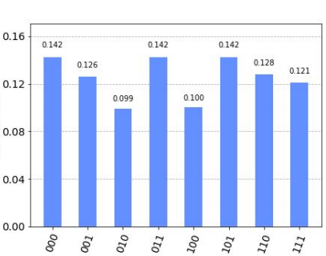

# QuantumTeleportation
Written in Qiskit using Juypter Notebook. 

For CMPT 409 Quantum Computing

Demonstrated quantum teleportation of a |o> state.

From the histogram plot at the end of the code, we see that the qubit 0’s state of |1> has
successfully been teleported to qubit 2. The classical measurement always has a 1 in the 2nd
qubit’s position, meaning qubit 2 collapses to the classical 1 bit 100% of the time.

We can teleport a superpostion of states by changing the initial state of qubit 2 ( the qubitbeing teleported) 
to a superposition of
both states 0 and 1 by applying a hadamard gate instead. From the resulting histogram, we
see that both 0 and 1 has been teleported, almost about an equal amount of times! This is
because qubit 2 is now teleporting a superposition of states. Once the measurement is
made, it collapses to either 0 or 1 equally with probability ½. The hadamard state has
successfully been teleported!

The final circuit.

Written in Qiskit using Juypter Notebook.
